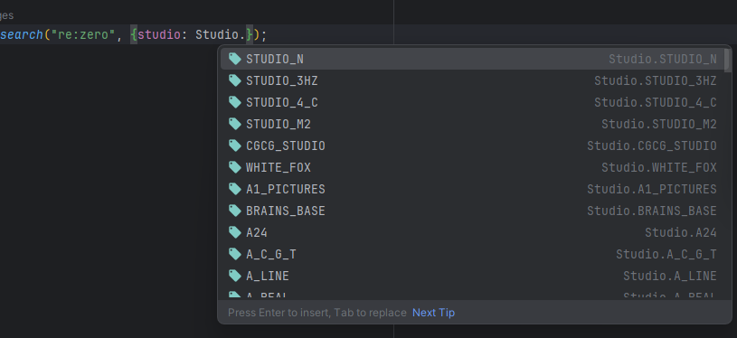
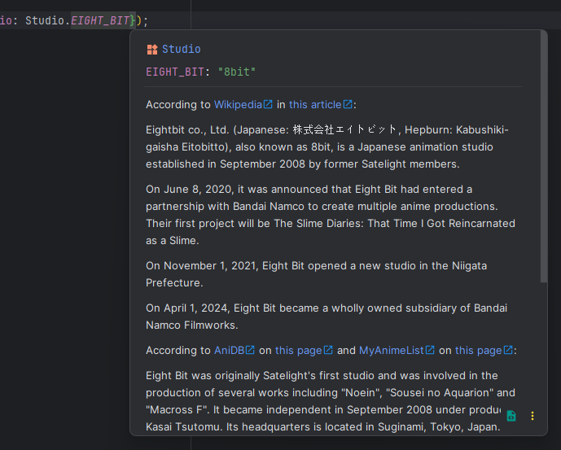

# Tadako - An unofficial AnimeWorld API

This is a library inspired by [MainKronos' AnimeWorld-API](https://github.com/MainKronos/AnimeWorld-API).
Tadako is still under development and as such expect changes and relatively frequent refactoring.

---

## Installation
This library depends on [puppeteer](https://github.com/puppeteer/puppeteer/) and [cheerio](https://github.com/cheeriojs/cheerio).\
We love and support [bun](https://bun.sh/) and as such the library is tailored to work perfectly with it.

Installation via bun:
```shell script
bun install -g tadako
```

Installation via npm:
```shell script
npm install -g tadako
```

> If you want to use the cli remember to install [mpv](https://mpv.io/) as well on your system. To do that you can use one
> of the following commands:
>
> #### Windows
> There are many different ways you can install mpv depending on your preferences.
>
> [chocolatey](https://chocolatey.org/):
> ```shell
> choco install mpvio.install
> ```
> 
> [scoop](https://scoop.sh/):
> ```shell
> scoop bucket add extras
> scoop install extras/mpv
> ```
> You can also download the official first-party nightly build by clicking [here](https://nightly.link/mpv-player/mpv/workflows/build/master/mpv-x86_64-windows-msvc.zip).
>
> #### Linux
> 
> Arch (Manjaro / SteamOS*): 
> ```shell
> sudo pacman -S mpv
> ```
> 
> Debian (Ubuntu):
> ```shell
> sudo apt update
> sudo apt install mpv
> ```
> 
> Fedora:
> ```shell
> sudo dnf install mpv
> ```
> 
> OpenSuse:
> ```shell
> sudo zypper install mpv
> ```
> 
> Gentoo:
> ```shell
> sudo emerge media-video/mpv
> ```
> 
> Void Linux
> ```shell
> sudo xbps-install -S mpv
> ```
>
> Flatpak*
> ```shell
> flatpak install flathub io.mpv.Mpv
> flatpak run io.mpv.Mpv
>  ```
>
> ###### The * indicates a distro/method that hasn't been tested thoroughly.
> 
> #### Mac OS
> ###### We didn't test any of the following sources and cannot provide support for Mac OS.
> Mac OS 13 (Intel) -> [Download](https://nightly.link/mpv-player/mpv/workflows/build/master/mpv-macos-13-intel.zip) \
> Mac OS 14 (Arm) -> [Download](https://nightly.link/mpv-player/mpv/workflows/build/master/mpv-macos-14-arm.zip) \
> Mac OS 15 (Arm) -> [Download](https://nightly.link/mpv-player/mpv/workflows/build/master/mpv-macos-15-arm.zip)

---

## CLI Usage

### Streaming
It is possible to watch anime directly through tadako.
```shell
tadako "violet evergarden"
```

### Downloading
Downloading anime from AnimeWorld has never been as easy.
```shell
tadako "violet evergarden" download
```

---

## Library Usage

### Importing
You can import the library into your project and just start working with it.

```typescript
import Tadako from "tadako";
```

### Fetching
We tried to make the entire process of fetching data as straightforward as possible, while at the 
same time sending as few requests as possible to [AnimeWorld](https://animeworld.so).\
As such some data like the title or the poster are fetched directly from the search request, as shown below:

```typescript
Tadako.search("re:zero").then(data => {
    console.log(data.results[0].title)
});
```

However, as some data needs to be fetched from other locations, forcing us to make another request. That doesn't happen
automatically as it would send a lot of useless requests to the server. We can manually call an update with the
remaining data by using `.init()` or `.data()` on any `Anime` object. 

```typescript
Tadako.search("re:zero").then(data => {
    data.results[0].data().then(remainingResults => {
        console.log(remainingResults.episodes[0].getDownloadURL());
    })
});
```

We highly recommend working with asynchronous functions as it highly reduces nesting and verbosity.

```typescript
const main = async () => {
    const search = await Tadako.search("re:zero");
    const anime = await search.results[0].data();
    console.log(anime.episodes[0].getDownloadURL());
}

main();
```

### Filtering

All the filters usable on the official AnimeWorld website are also available here.

We tried to make filters as easy to use as possible. We went as far as to creating an
enumerator for all the available studios, so you don't even have to remember how they are called exactly, and you don't
even have to bother remembering the correct casing. We handle it all.

```typescript
import Tadako, {Studio} from "./index";

const main = async () => {
    const search = await Tadako.search("re:zero", {studio: Studio.WHITE_FOX});
    const animeList = search.results;
    animeList.forEach(anime => console.log(anime.title));
}

main();
```

Depending on your environment and the IDE/Text Editor you are using, intellisense will help you find the studio you are
searching for in seconds. In the screenshot below we are using [Jetbrains](https://www.jetbrains.com/)' 
[Webstorm](https://www.jetbrains.com/webstorm/).


We are actively working on compiling small snippets of information for each and every studio and we also cite all the
sources that are helping us in doing so.


---

## TODO:

These are things that we still need to implement in no specific order.

- Verify that the files exist before downloading them
- Add support for different download servers
- Create documentation website
- Finish descriptions of all the studios.
- Automatic download of platform-specific dependencies (like mpv)
- Add proxy support
- Move help messages to a JSON file for compatibility